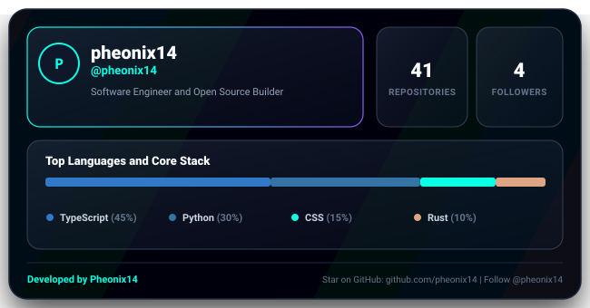

# 🎨 Rayz Glass Bento Cards Action

<p align="center">
  
</p>

<p align="center">
  <strong>Generate ultra-modern, glassmorphic cyber-glow Bento Grid cards for your GitHub Profile README. Powered by RayzHub design aesthetics.</strong>
</p>

<p align="center">
  <a href="https://github.com/pheonix14/rayz-glass-cards/stargazers"></a>
  <a href="https://github.com/pheonix14"></a>
  <a href="https://github.com/pheonix14/rayz-glass-cards/blob/main/LICENSE"></a>
</p>

---

## ⚡ What are Rayz Glass Cards?

Standard GitHub profile cards look dated. **Rayz Glass Bento Cards** brings high-end glassmorphism, cyber neon accents, and clean Bento Grid proportions to your profile:
- Dynamic live stats: Repositories, Followers, and Stars.
- Multi-segment glowing tech stack breakdown bar.
- Cyber-glow borders and backdrop translucent tiles.

---

## 🚀 Quickstart

Create `.github/workflows/glass-card.yml` in your profile repository (e.g. `your-username/your-username`):

```yaml
name: Update Glass Bento Card

on:
  schedule:
    - cron: '0 0 * * *' # Every midnight
  workflow_dispatch:

permissions:
  contents: write

jobs:
  bento:
    runs-on: ubuntu-latest
    steps:
      - name: Checkout Repository
        uses: actions/checkout@v4

      - name: Generate Glass Bento Card
        uses: pheonix14/rayz-glass-cards@v1.0.0
        with:
          github-token: ${{ secrets.GITHUB_TOKEN }}
          username: ${{ github.repository_owner }}
          theme: 'cyan-cyber' # Options: cyan-cyber, neon-purple, luxury-gold
          output-path: 'rayz-glass-card.svg'

      - name: Commit and Push
        run: |
          git config --global user.name "github-actions[bot]"
          git config --global user.email "github-actions[bot]@users.noreply.github.com"
          git add rayz-glass-card.svg
          git commit -m "chore: update glass bento card [skip ci]" || exit 0
          git push
```

### Embed in Your Profile README:
```markdown
<p align="center">
  
</p>
```

---

## ⚙️ Inputs & Outputs

### Inputs
| Input | Description | Default | Required |
| :--- | :--- | :--- | :--- |
| `github-token` | GitHub access token | `${{ github.token }}` | **Yes** |
| `username` | Target GitHub username | `${{ github.repository_owner }}` | No |
| `theme` | Preset: `cyan-cyber`, `neon-purple`, `luxury-gold` | `cyan-cyber` | No |
| `output-path` | Output path for SVG file | `rayz-glass-card.svg` | No |

---

## 🤝 Author & Credits

Developed with ❤️ by **[Pheonix14](https://github.com/pheonix14)**.

⭐ **If you like this design:**
* **[Star this repository on GitHub](https://github.com/pheonix14/rayz-glass-cards)**
* **[Follow @pheonix14](https://github.com/pheonix14)**

Licensed under the [MIT License](LICENSE).
